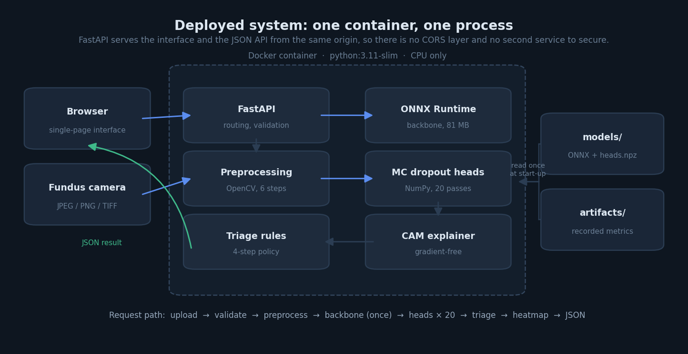
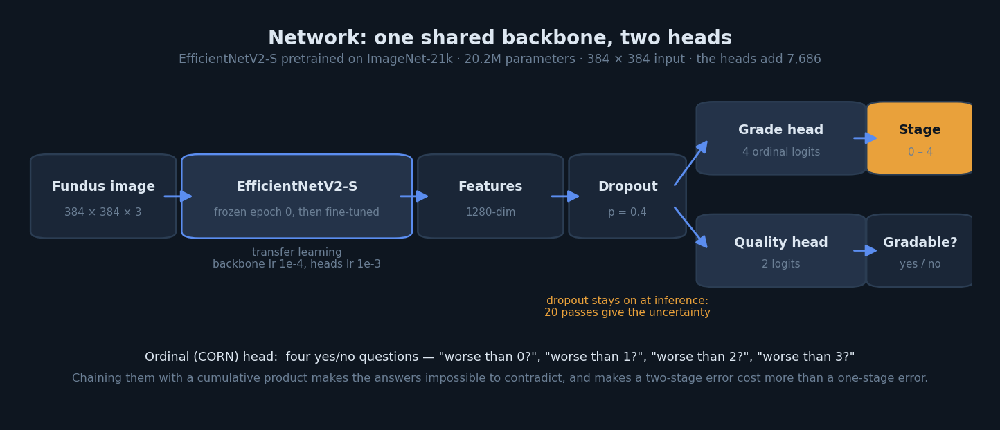
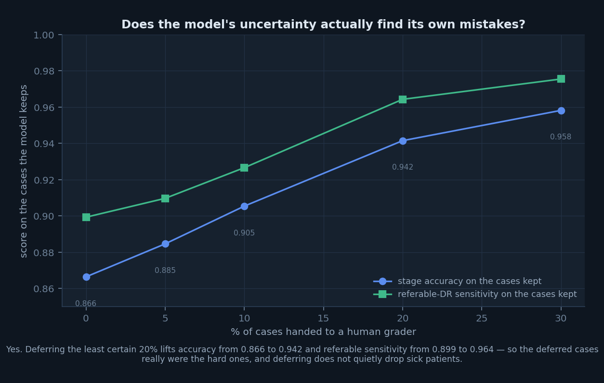

# RetinaTriage

Grades retinal fundus photographs on the five-stage diabetic retinopathy scale,
says how certain it is, and routes each case to the right next step.



> **Not a medical device.** A student prototype built for coursework. It has not
> been clinically validated and must not be used to make decisions about a real
> patient.

---

## What it does

Upload a fundus photograph and the app returns:

- **A stage**, 0 to 4, on the international DR scale
- **A continuous severity score** between 0.0 and 4.0, so a case sitting on a
  stage boundary looks like one instead of being rounded into a label
- **An uncertainty band** from 20 Monte-Carlo dropout passes
- **A triage action**: re-capture, human grading, ophthalmology referral, or
  routine rescreen — with the rule that decided it
- **The preprocessing pipeline**, step by step, so you can see what the network
  actually received
- **An evidence heatmap** showing which regions pushed the severity estimate up

The Streamlit app leads with the action in plain words and keeps the numbers —
severity ladder, per-stage probabilities, uncertainty, preprocessing stages —
behind one reveal. The sidebar holds the last ten readings so cases can be
compared without re-uploading; that history lives in the browser session only
and is never written to disk.

A separate **evidence** page carries the test-set results, the external
comparison and the stated limitations — reachable from a button on the reading
page, and kept off it so a single patient's readout is not buried under
aggregate statistics.

| | DDR test (internal) | APTOS 2019 (never trained on) |
|---|---|---|
| Stage accuracy | **0.8664** | 0.7018 |
| Macro F1 | 0.7282 | 0.4556 |
| Quadratic weighted kappa | **0.9072** | 0.7921 |
| Referable DR AUC | **0.9807** | 0.9640 |
| DR detection recall | 0.9350 | 1.0000 |

---

## Two front ends, one engine

| | Streamlit | FastAPI |
|---|---|---|
| Entry point | `streamlit_app.py` | `backend/main.py` |
| Hosting | Streamlit Community Cloud, no Docker | HF Spaces, Render, Fly, any VPS |
| Gives you | a working app | an app **and** a JSON API |

Both import the same `backend/` package — preprocessing, inference, the triage
rules and the recorded metrics are written once. Only `backend/main.py` imports
a web framework, which is what makes a second front end cheap rather than a
second implementation to keep in step.

## Quick start

```bash
git clone https://github.com/YOUR-USERNAME/dr-triage-app.git
cd dr-triage-app

python -m venv .venv && source .venv/bin/activate
pip install -r requirements.txt

python scripts/download_models.py     # 81 MB, from the GitHub Release

streamlit run streamlit_app.py        # → localhost:8501
# or
python app.py                         # FastAPI → localhost:8000
```

Without the weights the app still starts, in demo mode, with a banner saying
every number on screen is synthetic. That is enough to work on the interface.

With Docker:

```bash
docker build -t retinatriage .
docker run -p 8000:8000 -v "$(pwd)/models:/app/models" retinatriage
```

Hosting instructions — Streamlit Community Cloud, Hugging Face Spaces, Render,
Fly.io and a plain VPS — are in [`docs/deployment.md`](docs/deployment.md).

---

## How it works



**EfficientNetV2-S** pretrained on ImageNet-21k, 20.2M parameters, fine-tuned
with the backbone frozen for the first epoch and a 10× smaller learning rate
afterwards.

**Two heads on shared features.** A grade head with four ordinal outputs, and a
quality head that judges whether the photograph is gradable at all.

**An ordinal (CORN) loss instead of five-way softmax.** DR stages are ordered,
so calling a proliferative eye "No DR" should cost more than calling it
"Severe" — and under cross-entropy it does not. CORN asks four yes/no questions
("worse than 0?", "worse than 1?", …) chained through a cumulative product. The
output cannot contradict itself, and the measured loss for predicting 0 when the
truth is 4 is 4.018 against 1.018 for predicting 3.

**Uncertainty that costs almost nothing.** Dropout sits after the backbone, so
the expensive part runs once and only the heads repeat 20 times — about 190 ms
instead of nearly four seconds. This is why the model ships as two files rather
than one.

**Triage rules, checked in order.** Quality, then certainty, then severity. An
unreadable photograph of a severe eye is still an unreadable photograph.

---

## Does the uncertainty actually help?



Yes, and this is the result worth reading first. Deferring the least-certain 20%
of cases to a human lifts accuracy on the remainder from 0.866 to 0.942 — and
referable-DR sensitivity rises alongside it, 0.899 to 0.964, which rules out the
failure mode where a model flatters its own score by quietly deferring the sick
patients.

---

## Repository layout

```
backend/           the engine — preprocessing, inference, triage, explainability
streamlit_app.py   Streamlit entry point (router)
views/             the two Streamlit pages
streamlit_ui.py    shared Streamlit theme and components
frontend/          the FastAPI single-page interface, no build step
artifacts/         metrics recorded during training, read by the app at start-up
models/            exported weights (not in git — see models/README.md)
notebooks/         the training notebook, with outputs
scripts/           export, download, figure generation
tests/             44 tests
docs/              architecture, evaluation, model card, deployment, API
```

---

## API

| Route | Method | Purpose |
|---|---|---|
| `/` | GET | the reading interface |
| `/evidence` | GET | measured performance, limitations and benchmarks |
| `/api/health` | GET | model status and active thresholds |
| `/api/config` | GET | stage labels, descriptions, thresholds |
| `/api/metrics` | GET | evaluation results from the training run |
| `/api/samples` | GET | bundled example images |
| `/api/predict` | POST | grade an uploaded photograph |
| `/api/predict/sample` | POST | grade a bundled example |
| `/docs` | GET | generated OpenAPI documentation |

```bash
curl -X POST http://localhost:8000/api/predict \
  -F "file=@fundus.jpg" \
  -F "show_heatmap=true" | python -m json.tool
```

Response shape and field meanings in [`docs/api.md`](docs/api.md).

---

## Development

```bash
pip install -r requirements.txt -r requirements-dev.txt

python tests/make_fake_model.py --out models   # stand-in weights for testing
pytest tests/ -v                               # 58 tests, both front ends
ruff check backend/ scripts/ tests/
python scripts/make_figures.py                 # regenerate every figure
```

CI runs the tests on Python 3.10, 3.11 and 3.12, builds the Docker image, and
checks that the container answers on `/api/health`.

---

## Configuration

Everything is set through environment variables with working defaults — see
[`.env.example`](.env.example). The ones that change clinical behaviour:

| Variable | Default | Effect |
|---|---|---|
| `DR_UNGRADABLE_THRESHOLD` | `0.50` | when to ask for a new photograph |
| `DR_UNCERTAINTY_THRESHOLD` | `0.45` | when to hand over to a human grader |
| `DR_CONFIDENCE_THRESHOLD` | `0.55` | minimum confidence to report a stage |
| `DR_REFERRAL_GRADE` | `2` | the stage at which a patient is referred |

Read the model card before changing these. They were chosen on the validation
split, and moving them invalidates the measured triage distribution.

---

## Datasets

| Dataset | Images | Role |
|---|---|---|
| [DDR](https://github.com/nkicsl/DDR-dataset) | 12,522 | train / validation / test |
| [APTOS 2019](https://www.kaggle.com/competitions/aptos2019-blindness-detection) | 3,662 | external test only |

Neither dataset is redistributed here. Both have their own licence terms.

---
```
DDR:   Li et al. (2019), Information Sciences 501, 511-522
APTOS: APTOS 2019 Blindness Detection, Kaggle
CORN:  Shi, Cao & Raschka (2023)
```
